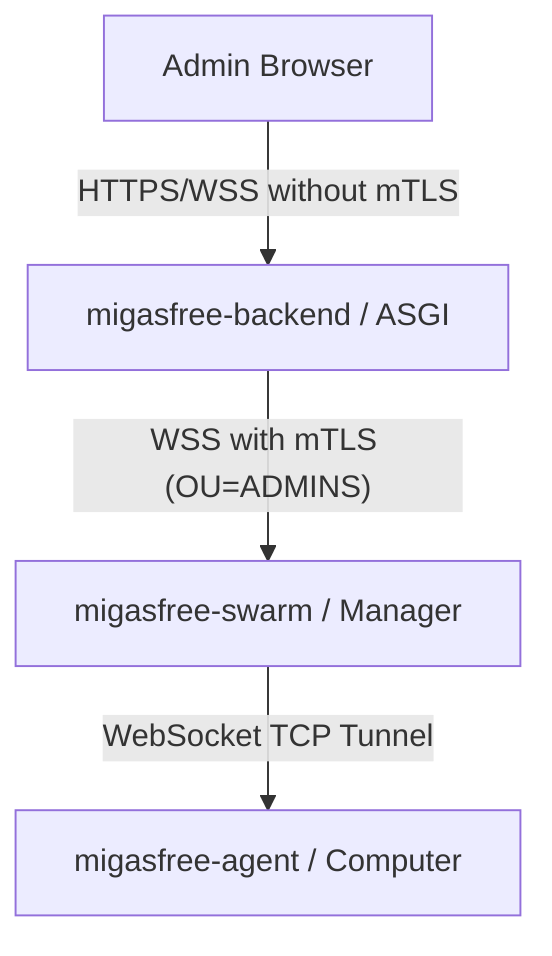

# Remote Access Architecture

This document provides a high-level conceptual explanation of the secure, integrated remote console architecture introduced in Migasfree. This architecture allows administrators to establish direct secure sessions (SSH, VNC, RDP, and Package Synchronization) with managed computer agents directly from the Quasar-based frontend.

---

## 1. High-Level Overview

Previously, remote access to managed agents was routed through a standalone, unauthenticated HTML page served by the Swarm Manager with client-side mTLS. This posed security challenges (requiring CA certificates in administrative browsers) and resulted in a disjointed user experience.

The new architecture unifies all remote control capabilities into a single-page application experience within **migasfree-frontend** using a secure proxy pattern through the backend.

---

## 2. Key Architecture Pillars

### A. The Secure ASGI Proxy Pattern

Instead of forcing the administrator's browser to present an mTLS client certificate directly to the Swarm Manager, the browser communicates over standard HTTPS/WSS with `migasfree-backend`.

- **Token Authentication**: Standard API tokens authorize the WebSocket handshake at `/ws/tunnel/computers/<id>/`.
- **mTLS Delegation**: `migasfree-backend` establishes a secure mTLS channel downstream to the Swarm Manager (`manager:8080`) using the repository's dedicated administrative client certificates (validated against `OU=ADMINS`).
- **Bidirectional Frame Relay**: Frame-forwarding between the client browser and the Swarm Manager is done entirely in memory inside Django Channels, avoiding browser certificate configuration and reducing the exposed attack surface.

### B. Inline Client-Side Rendering

All interactive terminals and graphical canvases are rendered directly inside Quasar components using lightweight client-side libraries:

- **`xterm.js`**: Standard for text-based interactive protocols (SSH and Package Synchronization). Employs `xterm-addon-fit` for seamless screen resizing.
- **`noVNC`**: Standard for graphical sessions (VNC). Employs dynamic HTML5 canvas elements to stream high-performance remote desktop frames without requiring system-level plug-ins.

### C. Zero Double-Login UI (Credential Injection)

To ensure maximum usability, the frontend intercepts the connection attempt to gather session-specific credentials (e.g. standard usernames for SSH, passwords for VNC, or simple confirmations for package synchronization) _before_ the WebSocket handshake begins.
These credentials are safely serialized as query parameters inside the WebSocket handshake request. The `TunnelConsumer` in `migasfree-backend` extracts and forwards them cleanly to the Swarm Manager, logging the administrator directly into the target machine.

---

## 3. Benefits & Enhancements

| Feature             | Legacy Standalone Console                         | New Integrated ASGI Console                                          |
| :------------------ | :------------------------------------------------ | :------------------------------------------------------------------- |
| **Security**        | Client browser required system mTLS certificates. | Client browser uses session tokens; backend handles mTLS.            |
| **User Experience** | Opened in a raw, unstyled separate browser tab.   | Premium responsive glassmorphic modal inside Quasar dashboard.       |
| **Integrity**       | Right-alignment "staircase effect" on stdout.     | Standardized `convertEol: true` conversion for flawless line breaks. |
| **Maintenance**     | Orphan templates/routers in swarm stack.          | Zero UI files in swarm; pure API-driven orchestration.               |
