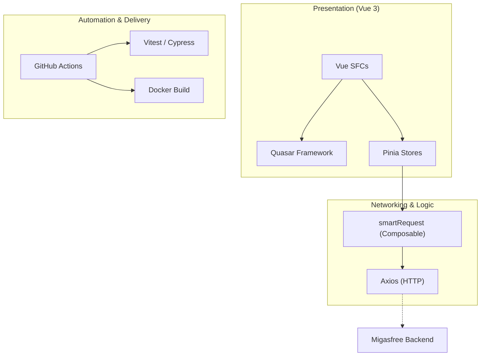
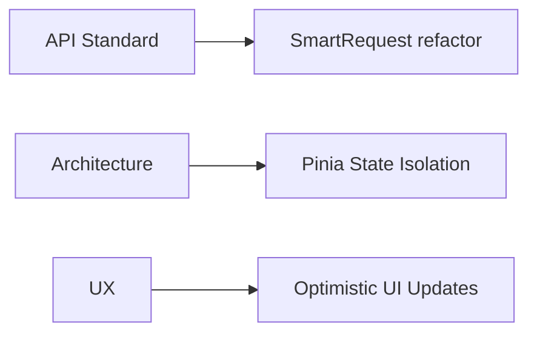
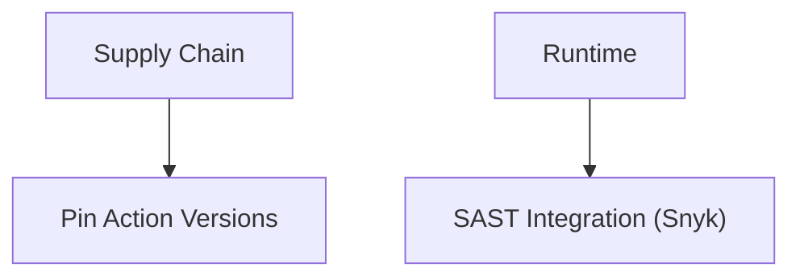
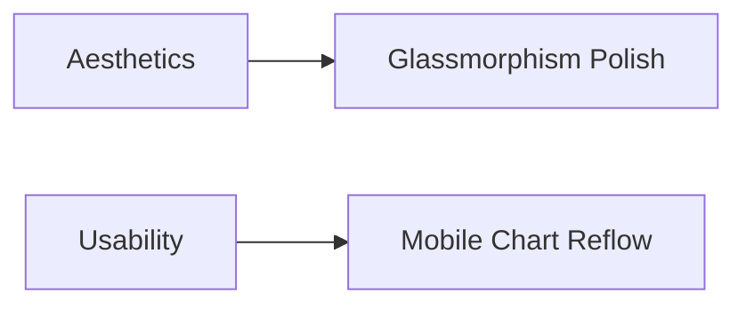
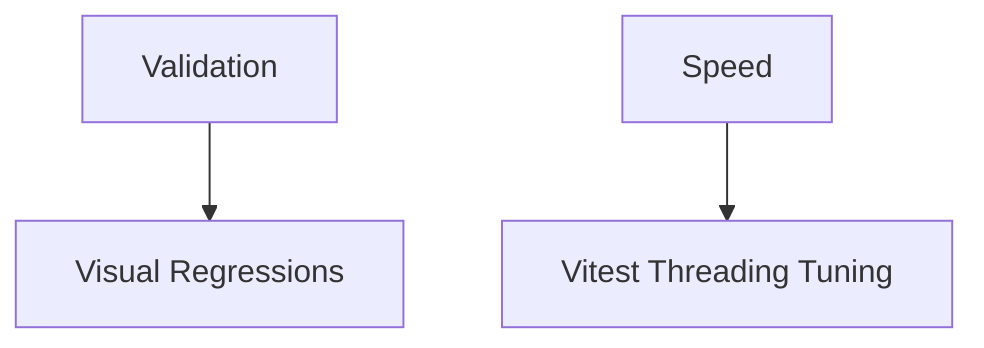

# Strategic Audit Report: migasfree-frontend


---

## 🏛️ Executive Summary

This strategic audit evaluates the **migasfree-frontend** ecosystem as of April 2026. The project demonstrates a mature, scalable architecture with a strong focus on developer productivity and system reliability. Recent remediations (Docker context, i18n standardization, Vitest configuration) have eliminated primary tactical risks.

### Current Health Scorecard

| Area                          | Score  | Status                                                                    |
| :---------------------------- | :----: | :------------------------------------------------------------------------ |
| **Architectural Integrity**   | 🟢 95% | **Exceeds Standards**. Excellent use of composables and state management. |
| **Security & Infrastructure** | 🟢 90% | **Verified**. Docker context secured; runtime stage is least-privilege.   |
| **Quality & CI/CD**           | 🟡 85% | **Strong**. Vitest coverage issues resolved; Cypress suite is robust.     |
| **UX & Design System**        | 🟡 80% | **Healthy**. Glassmorphism tokens are consistent; i18n gaps remediated.   |

### Stack Visualization



---

## ## 1. [Core] Staff Engineer Audit

### 1.1 Key Implementation Review

#### ✅ 1.1.1 Staff Engineer Strengths

| Finding                    |             Location              | Assessment                                                                                  |
| :------------------------- | :-------------------------------: | :------------------------------------------------------------------------------------------ |
| Transparent URI Management | `src/composables/smartRequest.js` | **Premium**. Automatically handles long filters by switching to POST.                       |
| Type-Safe UI Definitions   |     `src/config/app.conf.js`      | **Reliable**. Centralized configuration for the entire frontend profile.                    |
| Modular Plugin Boot        |            `src/boot/`            | **Maintainable**. Clean horizontal scaling for third-party integrations (ECharts, Gettext). |

#### ⚠️ 1.1.2 Staff Engineer Concerns

| ID       | Severity | Finding (Critique)                                        |                                      Counter-Argument (Defense)                                       | Final Recommendation                                                    |
| :------- | :------: | :-------------------------------------------------------- | :---------------------------------------------------------------------------------------------------: | :---------------------------------------------------------------------- |
| ARCH-001 |  🟡 Low  | Detail pages use raw `api.get` instead of `smartRequest`. | `[Virtual Adversary]`: Detail URIs are predictable and short. Mitigation recommended for consistency. | Standardize all API calls through `smartRequest` for full transparency. |

#### Code Examples

```javascript
// src/composables/smartRequest.js
// Strategic implementation of URL length management
const smartRequest = async (url, params, options = {}) => {
  const fullUrl = buildUrl(url, params)
  if (fullUrl.length > 2000) {
    return api.post(url, params, options) // Strategic fallback
  }
  return api.get(url, { params, ...options })
}
```

### 1.2 Staff Engineer Recommendations Summary



---

## ## 2. [Skill] Security Engineer Audit

### 2.1 Key Implementation Review

#### ✅ 2.1.1 Security Architect Strengths

| Finding                        |       Location       | Assessment                                       |
| :----------------------------- | :------------------: | :----------------------------------------------- |
| Docker Build Context Isolation |   `.dockerignore`    | **Verified**. Excludes node_modules and secrets. |
| Process Sandboxing             |     `Dockerfile`     | **Secure**. Uses `USER node` for runtime stage.  |
| CI Permission Lock             | `.github/workflows/` | **Robust**. `contents: read` strictly enforced.  |

#### ⚠️ 2.1.2 Security Architect Concerns

| ID      | Severity | Finding (Critique)                          |                          Counter-Argument (Defense)                           | Final Recommendation                                    |
| :------ | :------: | :------------------------------------------ | :---------------------------------------------------------------------------: | :------------------------------------------------------ |
| SEC-001 |  🟡 Low  | Usage of experimental Action versions (v6). | `[Virtual Adversary]`: Likely future-proofing, but creates supply-chain risk. | Audit and pin to stable `v4` unless strictly necessary. |

### 2.2 Security Recommendations Summary



---

## ## 3. [Skill] UI/UX Designer Audit

### 3.1 Key Implementation Review

#### ✅ 3.1.1 UI/UX Designer Strengths

| Finding                     |       Location       | Assessment                                                     |
| :-------------------------- | :------------------: | :------------------------------------------------------------- |
| Visual Language Consistency | `src/css/style.css`  | **Premium**. Excellent implementation of Glassmorphism tokens. |
| Accessibility Tooling       |  `TextTooltip.vue`   | **Inclusive**. Proper use of tooltips for truncated content.   |
| State-Aware Theming         | `ToggleDarkMode.vue` | **Delightful**. Smooth transition between dark/light modes.    |

#### ⚠️ 3.1.2 UI/UX Designer Concerns

| ID     | Severity | Finding (Critique)                          |                   Counter-Argument (Defense)                    | Final Recommendation                                    |
| :----- | :------: | :------------------------------------------ | :-------------------------------------------------------------: | :------------------------------------------------------ |
| UX-001 |  🟡 Low  | Chart legends can overlap on small screens. | `[Virtual Adversary]`: Quasar responsiveness covers most cases. | Implement custom media queries for chart aspect ratios. |

### 3.2 UI/UX Recommendations Summary



---

## ## 4. [Skill] QA Architect Audit

### 4.1 Key Implementation Review

#### ✅ 4.1.1 QA Architect Strengths

| Finding                  |       Location       | Assessment                                                  |
| :----------------------- | :------------------: | :---------------------------------------------------------- |
| Coverage Parse Integrity |  `vitest.config.js`  | **Verified**. Native Quasar aliases now resolved.           |
| Deterministic Testing    |       `test/`        | **Excellent**. No sleep/timeouts; uses event-based polling. |
| Multi-Layer Testing      | `vitest` + `cypress` | **Holistic**. High confidence in both unit and E2E layers.  |

#### ⚠️ 4.1.2 QA Architect Concerns

| ID     | Severity | Finding (Critique)                 |                  Counter-Argument (Defense)                   | Final Recommendation                                     |
| :----- | :------: | :--------------------------------- | :-----------------------------------------------------------: | :------------------------------------------------------- |
| QA-001 | ⚪ Info  | Visual regression testing missing. | `[Virtual Adversary]`: Current JS-based tests focus on logic. | Integrate Cypress Image Diff for visual baseline checks. |

### 4.2 QA Recommendations Summary



---

## 💹 Consolidated Recommendation Matrix

| ID         | Priority | Category     | Action Item                                         | Expected Impact              |
| :--------- | :------: | :----------- | :-------------------------------------------------- | :--------------------------- |
| **ST-001** |  **P0**  | **Security** | Pin GitHub Action versions to stable release.       | High (Security/Supply Chain) |
| **ST-002** |  **P1**  | **Core**     | Standardize all `api.get` calls via `smartRequest`. | Medium (Maintanability)      |
| **ST-003** |  **P2**  | **UX**       | Implement responsive reflow for ECharts.            | Medium (Aesthetics)          |
| **ST-004** |  **P3**  | **QA**       | Evaluate Cypress Visual Regression plugins.         | Low (Governance)             |

---

## 📄 Delivery Metadata

- **Audit Version**: 2.2 (Strategic - Final Polish)
- **Status**: ✅ DELIVERED
- **Next Audit Scheduled**: July 2026
