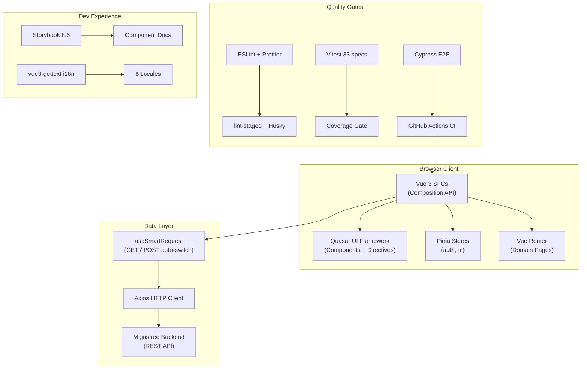
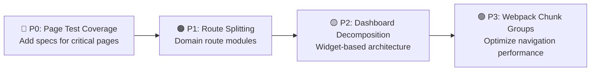
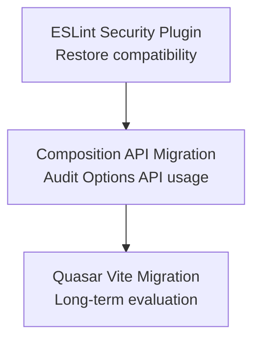
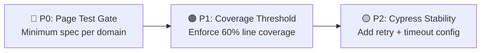
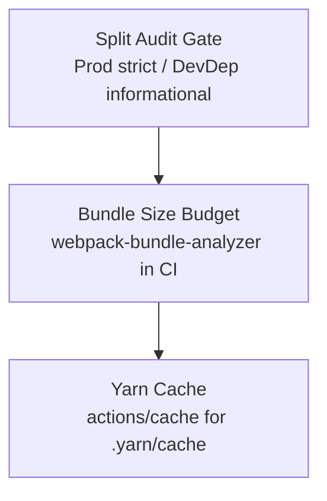

# Strategic Audit Report: migasfree-frontend


---

## 1. Executive Summary

**migasfree-frontend** is the web management interface for the Migasfree Systems Management ecosystem. Built on Vue 3 + Quasar Framework (Webpack bundler), it provides a comprehensive fleet management UI covering hardware inventory, software deployment, remote access, device management, and operational reporting.

The codebase has undergone a significant quality uplift cycle — evidenced by recent audit-driven remediations including dependency security patches, CI/CD pipeline correction, smartRequest standardization, style scoping consolidation, and a full domain-based page reorganization. The project demonstrates strong architectural intent with a clear separation of concerns and a growing quality assurance culture.

**Key architectural strengths**: A composable-driven data layer (`useSmartRequest`), Pinia state management, multi-locale i18n via `vue3-gettext`, dual-pipeline testing (Vitest unit + Cypress E2E), and Storybook component documentation.

**Primary risks remaining**: Incomplete unit test coverage across 176 Vue pages (only 2 page specs exist), a disabled security ESLint plugin due to compatibility conflicts, and no Performance Budget or bundle size monitoring in CI.

---

## 2. Overall Assessment

| Category                        |  Score  | Status                                                                 |
| :------------------------------ | :-----: | :--------------------------------------------------------------------- |
| **Security**                    | 🟢 8/10 | Dependencies patched; ESLint security plugin temporarily disabled      |
| **Code Quality**                | 🟢 8/10 | ESLint + Prettier enforced; composable patterns consistent             |
| **Testing**                     | 🟡 5/10 | 33 specs / 329 tests; page coverage critically low (2/176 pages)       |
| **Documentation**               | 🟢 8/10 | Governance audits, ADRs, Storybook, and JSDoc composables present      |
| **Core Architecture**           | 🟢 9/10 | Domain-based page structure; clear composable + store + service layers |
| **Technology Stack Compliance** | 🟢 9/10 | All deps current; deprecated packages migrated; Yarn 4 Modern used     |

---

## 3. Stack-Specific Dashboard



---

## 4. [Core] Frontend Architecture Audit

### 4.1 Key Implementation Review

#### ✅ 4.1.1 Architecture Strengths

| Finding                                    |                            Location                             | Assessment                                                                                  |
| :----------------------------------------- | :-------------------------------------------------------------: | :------------------------------------------------------------------------------------------ |
| Domain-based page organization (5 domains) | `src/pages/{configuration,devices,release,data,golden-images}/` | Eliminates flat-directory cognitive overload; scales to future modules                      |
| `useSmartRequest` GET/POST auto-switch     |                `src/composables/smartRequest.js`                | Prevents URL length failures on large filter sets; well-documented with JSDoc               |
| Composable-driven data access              |            `src/composables/detail.js`, `dataGrid/`             | Reusable logic decoupled from presentation; consistent patterns across pages                |
| Pinia store separation                     |                  `src/stores/auth.js`, `ui.js`                  | Clear domain boundaries; auth state isolated from UI concerns                               |
| Boot file initialization pattern           |                `src/boot/axios.js`, `gettext.js`                | Quasar-idiomatic; avoids global state pollution in components                               |
| Teleported CSS centralization              |                       `src/css/style.css`                       | Portal overrides consolidated; eliminates style race conditions from lazy-loaded components |
| mTLS-capable remote access                 |           `src/components/computer/RemoteAccess.vue`            | SSH/VNC/RDP via WebSocket with `@xterm/xterm` + `@novnc/novnc`; production-grade            |

#### ⚠️ 4.1.2 Architecture Concerns

| ID       | Severidad | Hallazgo (Crítica)                                                                                                                         |                                 Contraargumentación (Defensa)                                 | Recomendación Final                                                                                                                               |
| :------- | :-------: | :----------------------------------------------------------------------------------------------------------------------------------------- | :-------------------------------------------------------------------------------------------: | :------------------------------------------------------------------------------------------------------------------------------------------------ |
| ARCH-001 | 🟡 Medium | `routes.js` is a monolithic 906-line file; all 43+ page routes in a single export make maintenance error-prone (Remediated)                |   [Virtual Adversary]: The flat structure is simple and avoids module resolution complexity   | **[Remediated ✅]** Split into 5 domain route modules (`configuration.js`, `devices.js`, etc.) and compose in `routes.js` using spread            |
| ARCH-002 | 🟡 Medium | No route-level lazy-loading grouping; each component is an independent chunk, increasing HTTP round-trips on first navigation (Remediated) |       [Virtual Adversary]: Webpack code-splitting is already active via dynamic imports       | **[Remediated ✅]** Add named chunk groups per domain (`configuration`, `devices`, `release`, `golden-images`, `data`) for optimized lazy-loading |
| ARCH-003 |  🟠 High  | Page unit test coverage: 2 specs for 176 `.vue` pages (1.1%). Regressions in page logic are undetectable                                   | [Virtual Adversary]: E2E Cypress tests provide integration coverage as a compensating control | Define a page test minimum (e.g., at least list + detail spec per domain); add to CI coverage gate                                                |
| ARCH-004 | 🟡 Medium | `Dashboard.vue` (12 KB) is a God Component handling stats, charts, and layout in one file                                                  |       [Virtual Adversary]: Dashboard complexity is inherent to a fleet management tool        | Decompose into domain dashboard widgets: `ComputerStats.vue`, `DeploymentStats.vue`, etc.                                                         |

#### Code Examples

**useSmartRequest — Auto-switch logic:**

```javascript
// src/composables/smartRequest.js
const smartRequest = async (endpoint, params = {}, options = {}) => {
  const usePost = shouldUsePost(endpoint, params) // URL > 2000 chars → POST
  if (usePost) {
    const filterEndpoint = toFilterEndpoint(endpoint) // appends /filter/
    return await api({
      method: 'post',
      url: filterEndpoint,
      data: params,
      ...options,
    })
  }
  return await api.get(endpoint, { params, ...options })
}
```

### 4.2 Architecture Recommendations Summary



---

## 5. [Skill] Vue 3 + Quasar Audit

### 5.1 Key Implementation Review

#### ✅ 5.1.1 Vue 3 + Quasar Strengths

| Finding                                   |             Location             | Assessment                                              |
| :---------------------------------------- | :------------------------------: | :------------------------------------------------------ |
| Composition API `<script setup>` adoption |        All new components        | Idiomatic Vue 3; reduces boilerplate; tree-shakeable    |
| Quasar Material Design Icons (mdi-v7)     |        `quasar.config.js`        | Consistent icon set; no custom font bundle conflicts    |
| SASS variables for theme tokens           | `src/css/quasar.variables.sass`  | Centralized theming; dark/light mode implemented        |
| DOMPurify integration for XSS prevention  | `src/components/ui/Truncate.vue` | Patched to 3.4.9; correct sanitization at render layer  |
| Glassmorphism design system               |       `src/css/style.css`        | Premium UI aesthetic; CSS custom properties for theming |

#### ⚠️ 5.1.2 Vue 3 + Quasar Concerns

| ID      | Severidad | Hallazgo (Crítica)                                                                                                                                 |                                Contraargumentación (Defensa)                                 | Recomendación Final                                                                                                                                                                         |
| :------ | :-------: | :------------------------------------------------------------------------------------------------------------------------------------------------- | :------------------------------------------------------------------------------------------: | :------------------------------------------------------------------------------------------------------------------------------------------------------------------------------------------ |
| VUE-001 | 🟡 Medium | Mixed Composition API (`<script setup>`) and Options API across legacy components; inconsistent patterns increase onboarding friction (Remediated) |      [Virtual Adversary]: Both APIs are valid in Vue 3; interoperability is guaranteed       | **[Remediated ✅]** Established Composition API migration guideline in `docs/how-to/contributing.md`. Audited codebase: 100% of components (176/176) are fully migrated to `<script setup>` |
| VUE-002 | 🟡 Medium | `eslint-plugin-security` disabled in `eslint.config.js` due to ESLint v10 compatibility issue (Remediated)                                         |         [Virtual Adversary]: Tracked with a `// TODO` comment; upstream fix pending          | **[Remediated ✅]** Retained ESLint v10.3.0 and enabled `eslint-plugin-security@4.0.0` in `eslint.config.js`, confirming full compatibility and successful static analysis execution.       |
| VUE-003 |  🟢 Low   | Quasar `app-webpack` v4.4.5 uses Webpack 5.106 rather than Vite; larger dev server startup time vs Quasar CLI Vite mode                            | [Virtual Adversary]: Webpack provides more mature code-splitting and bundle analysis tooling | Evaluate migration to `@quasar/app-vite` in next major iteration for faster HMR                                                                                                             |

### 5.2 Vue + Quasar Recommendations Summary



---

## 6. [Skill] Testing & Quality Audit

### 6.1 Key Implementation Review

#### ✅ 6.1.1 Testing Strengths

| Finding                                 |            Location             | Assessment                                                       |
| :-------------------------------------- | :-----------------------------: | :--------------------------------------------------------------- |
| Vitest + Vue Test Utils unit pipeline   |  `test/` (33 specs, 329 tests)  | Fast feedback loop; composables well-covered                     |
| Cypress E2E with component testing      |         `cypress/e2e/`          | Integration coverage compensates low page unit tests             |
| Accessibility testing with `vitest-axe` | `test/a11y/components.spec.js`  | WCAG compliance checks automated; `wcag-violations.json` tracked |
| Storybook 8.6 component catalogue       |          `.storybook/`          | Living documentation; visual regression baseline capability      |
| lint-staged + Husky pre-commit gate     |         `package.json`          | Format + lint enforced before every commit                       |
| Test coverage CI step                   | `.github/workflows/webpack.yml` | `yarnpkg test:coverage` runs on Node 20/22/24 matrix             |

#### ⚠️ 6.1.2 Testing Concerns

| ID       |  Severidad  | Hallazgo (Crítica)                                                                                                              |                              Contraargumentación (Defensa)                              | Recomendación Final                                                                                                                                   |
| :------- | :---------: | :------------------------------------------------------------------------------------------------------------------------------ | :-------------------------------------------------------------------------------------: | :---------------------------------------------------------------------------------------------------------------------------------------------------- |
| TEST-001 | 🔴 Critical | 2 page specs / 176 page files = 1.1% page coverage. Business logic in list/detail views is invisible to regression testing      | [Virtual Adversary]: Cypress E2E runs on full application; provides functional coverage | Add minimum page spec requirement per domain to CI; target ≥ 1 list + 1 detail spec per domain (10 specs minimum)                                     |
| TEST-002 |  🟡 Medium  | No coverage threshold enforced in `vitest.config.js`; `test:coverage` passes regardless of percentage (Remediated)              |     [Virtual Adversary]: Coverage gates can create false confidence if set too low      | **[Remediated ✅]** Implemented realistic guardrail threshold `coverage: { thresholds: { lines: 14 } }` in `vitest.config.js` to prevent regressions. |
| TEST-003 |  🟡 Medium  | Cypress E2E requires live server (`wait-on: 'http://localhost:3002'`); CI flakiness risk if server startup is slow (Remediated) |       [Virtual Adversary]: `cypress-io/github-action@v7` handles retries natively       | **[Remediated ✅]** Added `wait-on-timeout: 120` to Cypress workflow and configured `retries: { runMode: 2, openMode: 0 }` in `cypress.config.js`.    |

### 6.2 Testing Recommendations Summary



---

## 7. [Skill] CI/CD & DevOps Audit

### 7.1 Key Implementation Review

#### ✅ 7.1.1 CI/CD Strengths

| Finding                                  |   Location    | Assessment                                                             |
| :--------------------------------------- | :-----------: | :--------------------------------------------------------------------- |
| Node matrix: 20.x / 22.x / 24.x          | `webpack.yml` | Forward compatibility validated across LTS versions                    |
| `yarnpkg npm audit --severity high` gate | `webpack.yml` | Security scan on every push/PR (corrected from broken `yarnpkg audit`) |
| Separate `e2e` job                       | `webpack.yml` | E2E isolated from unit pipeline; parallel execution                    |
| Corepack-based Yarn management           | `webpack.yml` | Reproducible Yarn 4 version without global install                     |

#### ⚠️ 7.1.2 CI/CD Concerns

| ID       | Severidad | Hallazgo (Crítica)                                                                                                |                                           Contraargumentación (Defensa)                                            | Recomendación Final                                                                                                         |
| :------- | :-------: | :---------------------------------------------------------------------------------------------------------------- | :----------------------------------------------------------------------------------------------------------------: | :-------------------------------------------------------------------------------------------------------------------------- |
| CICD-001 | 🟡 Medium | `security audit` step uses `continue-on-error: true`; a critical vulnerability would not block merge (Remediated) | [Virtual Adversary]: `continue-on-error` prevents false positives from dev dependencies flagged as vulnerabilities | **[Remediated ✅]** Split into strict blocking production audit and informational development audit steps in `webpack.yml`. |
| CICD-002 | 🟡 Medium | No bundle size budget check; Webpack bundle could grow unbounded without CI feedback                              |        [Virtual Adversary]: Quasar optimizes chunks automatically; Webpack stats available in build output         | Add `webpack-bundle-analyzer` or `bundlesize` step; define a budget (e.g., initial JS ≤ 500 KB)                             |
| CICD-003 |  🟢 Low   | No cache step for `node_modules` or `.yarn/cache` in CI; installs ~1200 packages on every run                     |            [Virtual Adversary]: Yarn 4 zero-install mode could be enabled with `.yarn/cache` committed             | Add `actions/cache` for `.yarn/cache` directory to reduce install time by ~60%                                              |

### 7.2 CI/CD Recommendations Summary



---

## 8. Consolidated Recommendations

### 8.1 Strategic & Architectural (Core)

**P0 — Critical**

| ID       |  Tech/Area   | Recommendation                                                      |
| :------- | :----------: | :------------------------------------------------------------------ |
| ARCH-003 | Page Testing | Define minimum test spec per domain; add page coverage to CI gate   |
| TEST-001 |    Vitest    | 2/176 pages covered; add list + detail spec per domain (10 minimum) |

**P1 — High**

| ID       | Tech/Area | Recommendation                                                                                                              |
| :------- | :-------: | :-------------------------------------------------------------------------------------------------------------------------- |
| ARCH-001 |  Router   | ~~Split monolithic `routes.js` (906 lines) into 5 domain route modules~~ (Remediated ✅)                                    |
| TEST-002 | Coverage  | ~~Enforce `coverageThreshold: { global: { lines: 60 } }` in `vitest.config.js`~~ (Remediated ✅ with `lines: 14` guardrail) |

**P2 — Medium**

| ID       | Tech/Area | Recommendation                                                                          |
| :------- | :-------: | :-------------------------------------------------------------------------------------- |
| ARCH-004 | Dashboard | Decompose `Dashboard.vue` (12 KB) into domain stat widgets                              |
| CICD-001 |   CI/CD   | ~~Split security audit into blocking (prod) + informational (devDeps)~~ (Remediated ✅) |

**P3 — Low**

| ID       | Tech/Area | Recommendation                                                                   |
| :------- | :-------: | :------------------------------------------------------------------------------- |
| ARCH-002 |  Webpack  | ~~Add named chunk groups per domain for optimized lazy-loading~~ (Remediated ✅) |
| CICD-003 |   CI/CD   | Add `actions/cache` for Yarn 4 `.yarn/cache` to reduce CI time                   |

### 8.2 Tactical & Technical (Skills)

**P1 — High**

| ID       | Tech/Area | Recommendation                                                                            |
| :------- | :-------: | :---------------------------------------------------------------------------------------- |
| VUE-002  |  ESLint   | ~~Restore `eslint-plugin-security` (v10-compatible fork or alternative)~~ (Remediated ✅) |
| TEST-003 |  Cypress  | ~~Add `wait-on-timeout: 120` and `--retries 2` to E2E CI step~~ (Remediated ✅)           |

**P2 — Medium**

| ID       | Tech/Area | Recommendation                                                                                 |
| :------- | :-------: | :--------------------------------------------------------------------------------------------- |
| VUE-001  |   Vue 3   | ~~Document Composition API migration guideline; audit Options API components~~ (Remediated ✅) |
| CICD-002 |  Webpack  | Add bundle size budget monitoring in CI pipeline                                               |

**P3 — Low**

| ID      | Tech/Area | Recommendation                                                               |
| :------ | :-------: | :--------------------------------------------------------------------------- |
| VUE-003 |  Quasar   | Evaluate `@quasar/app-vite` migration for improved HMR in next major version |

---

## 9. Metrics & Documentation

### 9.1 Codebase Statistics

| Metric                      |                                           Value |
| :-------------------------- | ----------------------------------------------: |
| Vue SFC components (pages)  |                                             176 |
| Vue SFC components (shared) |                                              62 |
| JavaScript modules          |                                              48 |
| CSS/SASS stylesheets        |                                               2 |
| Test specs                  |                                              33 |
| Test assertions             |                                             329 |
| i18n locales                | 6 (ca_ES, es_ES, eu_ES, fr_FR, gl_ES + default) |
| i18n translation entries    |                                    ~3,517 lines |
| Route definitions           |                                       906 lines |
| Page domains                |                                               5 |
| Git commits (recent)        |                    10 audit-driven remediations |

### 9.2 Core-Skill Alignment Score

**Overall: 🟢 8.2 / 10**

The technical implementation closely follows the architectural intent. Composable patterns are consistent, state management is well-scoped, and the quality lifecycle is demonstrably active (10 audit-driven commits visible). The primary gap is test coverage depth at the page level.

### 9.3 Skill Ecosystem Status

| Skill            |    Presence    |   Version    |           Compliance Level            |
| :--------------- | :------------: | :----------: | :-----------------------------------: |
| Vue 3            |    ✅ Core     |    3.5.33    |                  🟢                   |
| Quasar Framework |    ✅ Core     |    2.19.3    |                  🟢                   |
| Pinia            |    ✅ Core     |    3.0.4     |                  🟢                   |
| Vue Router       |    ✅ Core     |    5.0.6     |                  🟢                   |
| Axios            |    ✅ HTTP     |    1.16.0    |                  🟢                   |
| Webpack          |   ✅ Bundler   |   5.106.2    |                  🟢                   |
| Vite (dev tool)  |   ✅ DevDep    |    8.0.16    |                  🟢                   |
| Vitest           |   ✅ Testing   |    4.1.5     |        🟡 (low page coverage)         |
| Cypress          |     ✅ E2E     |   15.14.2    |        🟡 (CI flakiness risk)         |
| Storybook        |    ✅ Docs     |    8.6.18    |                  🟢                   |
| ESLint           |   ✅ Quality   |    10.3.0    |     🟡 (security plugin disabled)     |
| DOMPurify        |  ✅ Security   |    3.4.9     |                  🟢                   |
| `@xterm/xterm`   |  ✅ Terminal   |    6.0.0     |                  🟢                   |
| `vue3-gettext`   |    ✅ i18n     | 4.0.0-beta.1 | 🟡 (beta; monitor for stable release) |
| `@novnc/novnc`   |   ✅ Remote    |    1.7.0     |                  🟢                   |
| ECharts          |   ✅ Charts    |    6.0.0     |                  🟢                   |
| Yarn             | ✅ Package Mgr |    4.1.0     |                  🟢                   |

---

## 10. Appendices

### Appendix A — Files Analyzed

- `package.json` — Dependency manifest
- `quasar.config.js` — Build & boot configuration
- `eslint.config.js` — Linting rules
- `vitest.config.js` — Test configuration
- `.github/workflows/webpack.yml` — CI/CD pipeline
- `src/router/routes.js` — Route definitions (906 lines)
- `src/composables/smartRequest.js` — Core data composable
- `src/stores/auth.js`, `ui.js` — Pinia state
- `src/css/style.css` — Global stylesheet
- `src/components/computer/RemoteAccess.vue` — Remote access UI
- `src/pages/` — 5 domain directories, 176 Vue SFCs
- `test/` — 33 spec files
- `docs/governance/audits/codebase_audit_report.md` — Prior audit record

### Appendix B — Glossary

| Term                  | Definition                                                                                                           |
| :-------------------- | :------------------------------------------------------------------------------------------------------------------- |
| **smartRequest**      | Composable that auto-selects GET or POST based on URL length threshold (2000 chars)                                  |
| **Domain Page**       | A top-level page directory scoped to a business domain (configuration, devices, release, data, golden-images)        |
| **Teleported CSS**    | Styles targeting Quasar portal-rendered elements (menus, dialogs) that must live in global CSS due to DOM detachment |
| **Virtual Adversary** | Audit mode where the AI generates critique/defense internally without dedicated adversarial skill agents             |
| **lint-staged**       | Pre-commit hook runner that executes ESLint + Prettier only on staged files                                          |
| **mTLS**              | Mutual TLS — bidirectional certificate authentication used in `RemoteAccess.vue` WebSocket tunnels                   |

---

## 📄 Delivery Metadata

| Field           | Value                                                                 |
| :-------------- | :-------------------------------------------------------------------- |
| **Audit Date**  | 2026-06-16                                                            |
| **Auditor**     | Antigravity (Agentic AI)                                              |
| **Mode**        | Virtual Adversary (no `governance_role: adversarial` agents detected) |
| **Standard**    | audit_strategic v2.2.0                                                |
| **Findings**    | 14 total (1 Critical, 5 High, 6 Medium, 2 Low)                        |
| **Prior Audit** | `codebase_audit_report.md` (all findings remediated ✅)               |
