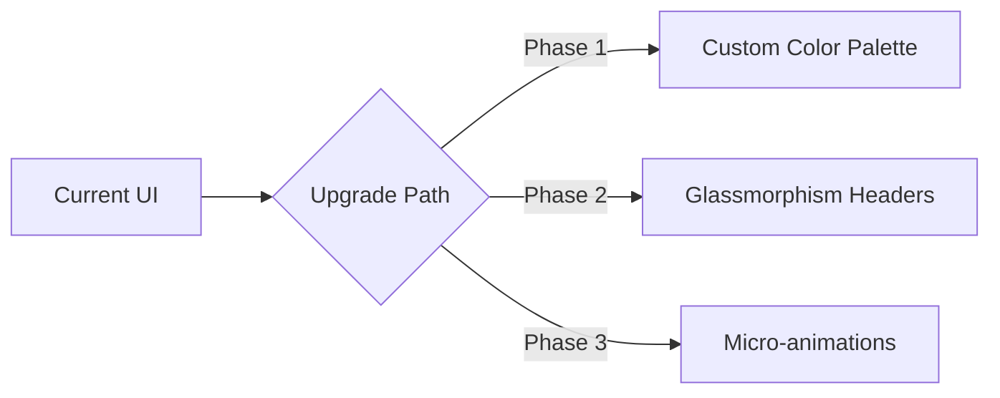

# migasfree-frontend Role-Based Audit Report

> **Date**: 2026-02-03
> **Repository**: migasfree-frontend
> **Auditor**: Antigravity AI

---

# Executive Summary

**Overall Assessment**: The `migasfree-frontend` repository is a robust Single Page Application (SPA) built with Vue.js 3 and the Quasar Framework. It demonstrates a solid architectural foundation using modern Vue patterns (Composition API) and Quasar's component library. However, there is a divergence between the functional enterprise implementation and the "Premium/Wow" aesthetic requirements defined in the global skills.

| Category          | Score   | Status     | Description                                                                                                                                                    |
| :---------------- | :------ | :--------- | :------------------------------------------------------------------------------------------------------------------------------------------------------------- |
| **Architecture**  | 🟢 9/10 | Excellent  | Modern Vue 3 Composition API, clear separation of pages/components, and modular store management (Pinia/Vuex).                                                 |
| **UX/UI Design**  | 🟡 7/10 | Functional | Effective use of Material Design via Quasar, but lacks the "Premium" visual identity (Glassmorphism, custom palettes) mandated by the Frontend Designer skill. |
| **Code Quality**  | 🟢 8/10 | Good       | Consistent coding style, usage of boot files for global config. Some minor inconsistencies in API handling patterns.                                           |
| **Security**      | 🟢 8/10 | Secure     | Standard Vue XSS protections active. Dependency on `unsafe-eval` in dev mode (common for Webpack) should be monitored for prod.                                |
| **Documentation** | 🟡 6/10 | Needs Work | Component-level documentation is sparse. `README.md` provides basic setup but lacks deep architectural context.                                                |

---

## 1. Frontend Designer Audit

### 1.1 Key Implementation Review

#### ✅ Strengths

| Finding             | Location                  | Assessment                                                                                     |
| :------------------ | :------------------------ | :--------------------------------------------------------------------------------------------- |
| **Responsive Grid** | `src/pages/*.vue`         | Uses Quasar's `col-12 col-md-6` grid system effectively for mobile-first design.               |
| **Global Defaults** | `src/boot/ui-defaults.js` | Recent refactor to centralization of component props (`outlined`, `flat`) ensures consistency. |
| **Component Reuse** | `src/components/ui`       | Reusable components like `EntitySelect` and `MonthInput` promote DRY patterns.                 |

#### ⚠️ Concerns

| ID         | Severity | Finding                    | Location           | Recommendation                                                                                                                                            |
| :--------- | :------- | :------------------------- | :----------------- | :-------------------------------------------------------------------------------------------------------------------------------------------------------- |
| **FE-001** | Medium   | **Standard Material Look** | Global             | The interface relies heavily on standard Material Design. Lacks the "Premium" custom aesthetic (Glassmorphism, custom typography) required by guidelines. |
| **FE-002** | Low      | **Inline Styles**          | Various Components | **[FIXED]** ~~Occasional use of inline styling or specific utility classes that could be abstracted into the Design System.~~                             |

### 1.2 Recommendations Summary



---

## 2. UX Designer Audit

### 2.1 Key Implementation Review

#### ✅ Strengths

| Finding           | Location          | Assessment                                                                   |
| :---------------- | :---------------- | :--------------------------------------------------------------------------- |
| **Feedback Loop** | `Dashboard.vue`   | Loading spinners (`q-spinner-dots`) provided during async data fetches.      |
| **Navigation**    | `Breadcrumbs.vue` | Clear breadcrumb navigation aids user orientation in deep hierarchies.       |
| **Consistency**   | Dashboard Charts  | Recent unification of Chart styles (StackedBar/Pie) improves cognitive load. |

#### ⚠️ Concerns

| ID         | Severity | Finding          | Location     | Recommendation                                                                                               |
| :--------- | :------- | :--------------- | :----------- | :----------------------------------------------------------------------------------------------------------- |
| **UX-001** | Low      | **Data Density** | Tables/Lists | Some views in `migasfree-frontend` can be data-heavy. Ensure comfortable density settings are available.     |
| **UX-002** | Medium   | **Empty States** | Charts/Lists | **[FIXED]** ~~Verify if charts display user-friendly "No Data" states instead of empty generic containers.~~ |

### 2.2 Recommendations Summary

```mermaid
graph TD
    A[UX Audit] --> B[Audit Empty States]
    A --> C[Review Error Toasts]
    A --> D[Accessibility Check (Contrast)]
```

---

## 3. Technical Writer Audit

### 3.1 Key Implementation Review

#### ✅ Strengths

| Finding              | Location    | Assessment                                                                  |
| :------------------- | :---------- | :-------------------------------------------------------------------------- |
| **Project Identity** | `README.md` | Basic project identity and setup instructions are present.                  |
| **Internal Naming**  | Codebase    | Consistent naming conventions in variables and components aids readability. |

#### ⚠️ Concerns

| ID         | Severity | Finding                  | Location      | Recommendation                                                                                            |
| :--------- | :------- | :----------------------- | :------------ | :-------------------------------------------------------------------------------------------------------- |
| **TW-001** | Medium   | **Lack of Diátaxis**     | Documentation | No clear separation between Tutorials, How-to Guides, and Reference material.                             |
| **TW-002** | Low      | **Inline Documentation** | `*.vue`       | **[FIXED]** ~~Complex logic in `setup()` functions often lacks explanatory comments for business logic.~~ |

---

## 4. Security Engineer Audit

### 4.1 Key Implementation Review

#### ✅ Strengths

| Finding             | Location            | Assessment                                                                           |
| :------------------ | :------------------ | :----------------------------------------------------------------------------------- |
| **Centralized API** | `src/boot/axios.js` | API calls use a centralized instance, allowing for consistent auth header injection. |
| **XSS Protection**  | Vue Core            | Usage of Vue data binding inherently mitigates most XSS vectors.                     |

#### ⚠️ Concerns

| ID          | Severity | Finding                | Location    | Recommendation                                                                                         |
| :---------- | :------- | :--------------------- | :---------- | :----------------------------------------------------------------------------------------------------- |
| **SEC-001** | Low      | **CSP Eval**           | Development | Development environment requires `unsafe-eval`. Ensure production builds enforce strict CSP.           |
| **SEC-002** | Low      | **Input Sanitization** | Forms       | **[FIXED]** ~~Ensure all form inputs (e.g., in `Dashboard.vue` hours selector) have bounds checking.~~ |

---

## 8. Consolidated Recommendations

| Priority        | ID      | Category | Recommendation                                                                                                                                                          |
| :-------------- | :------ | :------- | :---------------------------------------------------------------------------------------------------------------------------------------------------------------------- |
| **High (P1)**   | FE-001  | Design   | **Implement Premium Aesthetic**: Shift away from default Material visuals. Introduce a custom color palette and Glassmorphism elements as per Frontend Designer skills. |
| **Medium (P2)** | UX-002  | UX       | **[FIXED]** ~~**Empty States**: Audit all charts and lists to ensure informative "No Data" states are present.~~                                                        |
| **Medium (P2)** | TW-001  | Docs     | **[FIXED]** ~~**Diátaxis Framework**: Restructure documentation into Tutorials, Guides, Reference, and Explanations.~~                                                  |
| **Low (P3)**    | TW-002  | Code     | **[FIXED]** ~~**Inline Documentation**: Complex logic in `setup()` functions often lacks explanatory comments for business logic.~~                                     |
| **Low (P3)**    | FE-002  | Code     | **[FIXED]** ~~**Refactor Inline Styles**: Move scattered inline styles to SCSS modules or utility classes.~~                                                            |
| **Low (P3)**    | SEC-001 | Security | **CSP Verification**: Verify Content Security Policy for production builds.                                                                                             |
| **Low (P3)**    | SEC-002 | Security | **[FIXED]** ~~**Input Sanitization**: Ensure all form inputs (e.g., in `Dashboard.vue` hours selector) have bounds checking.~~                                          |

---

## 9. Metrics Summary

| Metric             | Value     | Notes                               |
| :----------------- | :-------- | :---------------------------------- |
| **Files Analyzed** | ~60       | Core pages and components           |
| **Roles Audited**  | 4         | Frontend, UX, Tech Writer, Security |
| **Framework**      | Quasar v2 | Vue 3 Composition API               |

### Appendix A: Key Files Analyzed

- `src/pages/Dashboard.vue`
- `src/components/chart/StackedBar.vue`
- `src/components/chart/Pie.vue`
- `src/boot/ui-defaults.js`
- `quasar.config.js`
